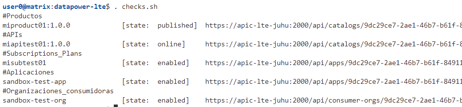

# Local Test Environment Hello World example - Apiconnect & Datapower
Repositorio base para Local Test Environment de Datapower

1.  Descargar el aplicativo apic-lte y las imágenes de docker:
    Dependiendo de la versión que desee utilizar
    -   [API Connect 10.0.2.0 is now available](https://www.ibm.com/support/pages/node/6427863)
    -   [API Connect v10.0.5.0 is now available](https://www.ibm.com/support/pages/node/6592957)
    -   [API Connect v10.0.5.1 is now available](https://www.ibm.com/support/pages/node/6607906)
    -   [API Connect v10.0.5.2 is now available ](https://www.ibm.com/support/pages/node/6839631)
    -   [API Connect v10.0.5.2-ifix1 is now available](https://www.ibm.com/support/pages/node/6857497)
    -   [API Connect v10.0.5.3 is now available](https://www.ibm.com/support/pages/node/6965806)
    -   [API Connect v10.0.5.4 is now available](https://www.ibm.com/support/pages/node/7011905)
    -   [API Connect v10.0.5.5 is now available](https://www.ibm.com/support/pages/node/7041606)
    -   [API Connect v10.0.5.6 is now available](https://www.ibm.com/support/pages/node/7116117)
    -   [API Connect v10.0.7.0 is now available](https://www.ibm.com/support/pages/node/7031975)
    
    Se muestra los archivos a descargar:
    {width=70%}

    Los archivos contienen:
    -   apic-lte-images_10.0.5.2.tar.gz : Imágenes de docker para el runtime
    -   apic-lte-linux_10.0.5.2: La cli para usar Local Test Environment
    -   toolkit-loopback-designer-windows_10.0.5.2.zip: El apic cli y el Designer Toolkit

2.  Ejecutar Local Test Environment
    - Cargar las ímagenes en docker
      ```
      docker load < apic-lte-images_10.0.5.2.tar.gz
      ```
    - Ejecutar el LTE
      ```
      apic-lte-linux_10.0.5.2 start --datapower-gateway-enabled --datapower-api-gateway-enabled
      ```
    
    * Recomiendo renombrar apic-lte-linux_10.0.5.2 a apic-lte

3.  Verificar el estado del entorno de ejecución
    ```shell
    $ ./apic-lte status
    ```
    {width=70%}
    
4.  Esto crea lo siguiente:
    - Una Organización llamada: **localtest**
    - Un Catálogo llamado: **sandbox**
    - Una Aplicación: **sandbox-test-app**
    - Una Organización consumidora: **sandbox-test-org**
    - Credenciales para probar las apis:
      ```yaml
      client id       :   X-IBM-Client-Id
      client secret   :   X-IBM-Client-Secret
      ```

5.  Iniciar sesión en la consola de APIC usando los datos predeterminados
    ```shell
    apic login --server localhost:2000 --username shavon --password 7iron-hide --realm provider/default-idp-2

    #Como administrador, en caso de se necesario
    apic login --server localhost:2000 --username admin --password 7iron-hide --realm admin/default-idp-1
    ```
    {width=70%}

6.  Publica el producto,api y subscription:
    ```sh
    ./deploy.sh
    ```
    {width=50%}
7.  Verificar:
    ```sh
    ./checks.sh
    ```
    
8. Invocar API
    ```sh
    API_URL="https://localhost:9444/localtest/sandbox/miapitest01/"
    API_USR=""
    API_SEC=""
    curl -s -k -X GET ${API_URL} -H "X-IBM-Client-Id: ${API_USR}" -H "X-IBM-Client-Secret: ${API_SEC}" | jq
    ```
10. En el API Designer Tools
   {width=70%}
11. Eliminar todo:
    ```
    apic products:delete -s https://localhost:2000 -o localtest -c sandbox --scope catalog miproduct01:1.0.0
    ```
12. Referencias adicionales LTE
    - [Testing an API with the Local Test Environment](https://www.ibm.com/docs/en/api-connect/10.0.5.x_lts?topic=api-testing-local-test-environment)
    - [Securing APIs using OAuth with Local Test Environment (LTE) and API Designer](https://community.ibm.com/community/user/integration/blogs/swetha-sridharan1/2019/09/04/securing-apis-using-oauth-with-local-test-environment-lte-and-api-designer)
    - [Securing APIs using OAuth with Local Test Environment (LTE) and API Designer (video)](https://community.ibm.com/community/user/integration/viewdocument/testing-api-secured-with-oauth-usin?CommunityKey=2106cca0-a9f9-45c6-9b28-01a28f4ce947&tab=librarydocuments)
    - [Securing APIs using OAuth with Local Test Environment (LTE) and API Designer (repo)](https://github.com/Swetha-Sridharan/OAuth)
    - [Creating TLS Client Profile on Local Test Environment (LTE)](https://community.ibm.com/community/user/integration/blogs/swetha-sridharan1/2020/01/29/creating-tls-client-profile-on-local-test-environment-lte)
    - [Creating TLS Client Profile on Local Test Environment (LTE) (repo)](https://github.com/Swetha-Sridharan/TLS-Client-Profile)
13. Referencias adicionales
    -   [GatewayScript code examples](https://www.ibm.com/docs/en/api-connect/10.0.5.x_lts?topic=gatewayscript-code-examples)
    -   [Example Toolkit Scripts](https://github.com/ibm-apiconnect/example-toolkit-scripts)
    -   [Discover Bluemix, IBM Cloud Platform, through a set of hands-on labs.](https://github.com/ADesprets/bluemix-labs.git)
    -   [Lab API - Manage your APIs with API Connect](https://github.com/ADesprets/bluemix-labs/blob/master/Lab%20API%20-%20Manage%20your%20APIs%20with%20API%20Connect/README-V10.md)
    -   [Secure your microservice with DataPower](https://medium.com/@wintonjkt/secure-your-microservice-with-datapower-e26d6cd8d9bb)
    -   [Secure and Control Microservices using DataPower API Gateway](https://github.com/ozairs/apigateway.git)
    -   [GatewayScript Hello World](https://www.linkedin.com/pulse/gatewayscript-hello-world-jose-ramon-huerga-ayuso)
    -   [IBM API Connect - Hello World API - Demo](https://www.itlec.com/2023/05/ibm-api-connect-hello-world-api-demo.html)
    -   [Gateway programming model and GatewayScript](https://www.ibm.com/docs/en/datapower-gateway/10.5.x?topic=gateway-programming-model-gatewayscript)
    -   [Tutorial: Implementing OAuth Security](https://www.ibm.com/docs/en/api-connect/2018.x?topic=tutorials-tutorial-implementing-oauth-security#tutorial_apionprem_oauth_passgrant__task_make_provider)
    -   [IBM API Connect Tutorial: Part-1 Develop your first API](https://iteritory.com/ibm-api-connect-tutorial-part-1-develop-your-first-api/)
